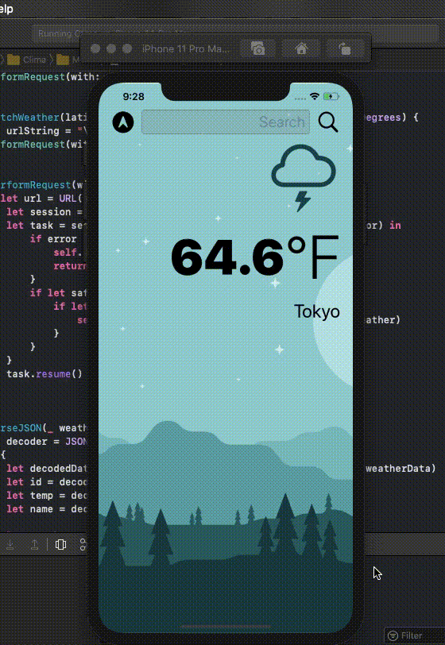

# WeatherApp
Practiced Swift development by creating this app that provides you with the real time weather of any city around the globe. Made with Swift and OpenWeather API. 

Demonstrated: 

- Using Protocols to set requiremtns for certain UI fields.  
- Using Apple's Delegate Design Pattern to implement efficent code. 
- Using OpenWeather API to pull real time weather data. 
- Using JSON to parse and write data into Swift. 
- Multilevel use of OOP. 
